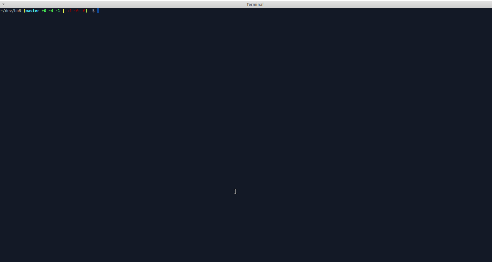

# I can haz BB-8 ?

Dodgy console rendered game where you control BB-8 to collect light sabers...

## WAT

This is a "game" hastily hacked together at [CampJS VI](http://vi.campjs.com/)

The idea was a blatant attempt to gain attention for my other project [2 Idiots 1 keyboard](https://github.com/MauriceButler/2i1k) so I could win a BB-8™ DROID BY SPHERO from a Camp Sponsor [BrainTree](https://www.braintreepayments.com/)

Thanks to [Steve Cooper](https://github.com/developersteve) - [@DeveloperSteve](https://twitter.com/DeveloperSteve) for picking me as the winner.

## Play

1. Clone
2. npm i
3. node index.js

## Controls

awsd - move BB-8

The game has 3 levels

If you manage to collect all the sabers on level 3 the game will crash.

Cause I was lazy.

Also, there is not collision detection on walls...

:shipit:

